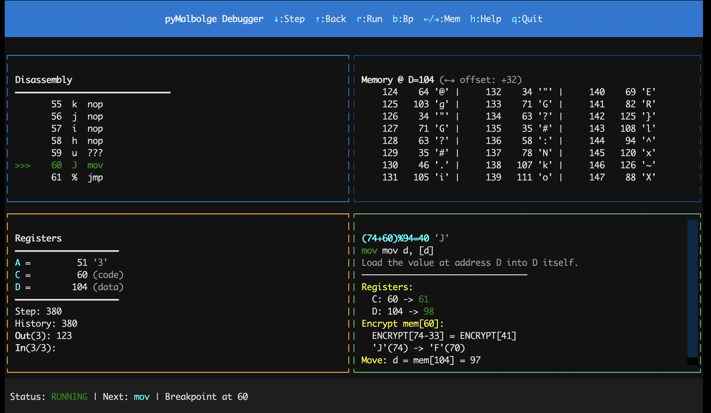

# pyMalbolge

This is a fork from https://github.com/Avantgarde95/pyMalbolge

Simple [Malbolge](https://en.wikipedia.org/wiki/Malbolge) interpreter in Python with built-in debugger — plus a **pure-Python compiler** that turns a subset of Python into runnable Malbolge20 programs.

**Supports multiple variants:**
- **Original Malbolge** - 10 trits, 59,049 memory cells
- **Malbolge20** - 20 trits, ~3.48 billion memory cells (sparse memory)

## Installation

```bash
# Basic installation
pip install malbolge

# With TUI debugger support
pip install malbolge[tui]
```

## Usage

### Command Line

```bash
# Run a Malbolge program
python3 -m malbolge hello.mal

# Run with Malbolge20 variant
python3 -m malbolge --variant=malbolge20 program.mal

# Run with input (for programs that read stdin)
python3 -m malbolge cat.mal -i "Hello World"

# Start debugger (CLI)
python3 -m malbolge debug hello.mal

# Start debugger (TUI, requires textual)
python3 -m malbolge debug --tui hello.mal

# Debug with Malbolge20 variant
python3 -m malbolge debug --variant=malbolge20 program.mal
```

### Python API

```python
from malbolge import eval

# Hello World
eval('''(=<`#9]~6ZY32Vx/4Rs+0No-&Jk)"Fh}|Bcy?`=*z]Kw%oG4UUS0/@-ejc(:'8dc''')
# Output: Hello World!

# Cat program with input
eval('''(=BA#9"=<;:3y7x54-21q/p-,+*)"!h%B0/.~P<<:(8&66#"!~}|{zyxwvugJ%''', "abc123")
# Output: abc123
```

#### Malbolge20 API

```python
from malbolge import eval20

# Run code with 20-trit operations
result = eval20(code, input_data)
```

> **Note:** Malbolge20 uses 20-trit `crazy()` operations, which produce different results than the original 10-trit version. Programs written for original Malbolge will **not** work correctly in Malbolge20.

### Debugger API

```python
from malbolge import MalbolgeDebugger
from malbolge.core import MalbolgeConfig

# Create debugger instance (original Malbolge)
dbg = MalbolgeDebugger(source_code, input_data)

# Create debugger for Malbolge20
config = MalbolgeConfig.malbolge20()
dbg = MalbolgeDebugger(source_code, input_data, config=config)

# Set breakpoints
dbg.add_breakpoint(10)

# Step execution
state = dbg.step()      # Execute one instruction
state = dbg.step_back() # Undo last instruction
state = dbg.run()       # Run until breakpoint

# Inspect state
print(dbg.registers)    # {'a': 0, 'c': 5, 'd': 45}
print(dbg.output)       # Program output so far
print(dbg.disassemble(0, 10))  # Disassemble instructions
```

## Debugger

### CLI Debugger

Interactive command-line debugger similar to GDB.

```
(maldbg) break 10       # Set breakpoint at address 10
(maldbg) run            # Run until breakpoint
(maldbg) step 5         # Step 5 instructions
(maldbg) back 2         # Step back 2 instructions
(maldbg) examine 0 20   # Examine memory at address 0
(maldbg) disassemble    # Show disassembly
(maldbg) registers      # Show register values
(maldbg) output         # Show program output
(maldbg) help           # Show all commands
```

### TUI Debugger

Visual terminal-based debugger with split-screen interface.



**Keybindings:**
- `↓` - Step one instruction
- `↑` - Step back
- `r` - Run until breakpoint
- `b` - Toggle breakpoint at current address
- `←` / `→` - Scroll memory view left/right
- `0` - Reset memory scroll to D pointer
- `h` / `?` - Show help
- `q` - Quit

## Compiler (Python → Malbolge20)

A complete, pure-Python compilation pipeline — no C++/flex/bison/Perl build
dependencies. It includes faithful Python ports of the Nagoya University
Malbolge20 toolchain plus our own Python front-end:

```
Python subset ──py2c──> C subset ──c2mg──> .mg ──mg2mc──> .mc (LAL) ──mc2mb──> .mb (Malbolge20)
       └────────────────py2mg (direct backend)──┘
```

### Command line

```bash
# Compile a Python file to a runnable Malbolge20 program
python3 -m malbolge compile examples/foo.py -o foo.mb

# Run it
python3 -m malbolge --variant=malbolge20 foo.mb

# Direct backend (skips the C layer; typically 2-4x smaller output,
# supports double recursion natively)
python3 -m malbolge compile foo.py --backend=direct -o foo.mb

# Inspect intermediate stages
python3 -m malbolge compile foo.py --emit-c - --emit-mg foo.mg --emit-mc foo.mc
```

### Python API

```python
from malbolge.compiler import compile_python_to_mb
from malbolge import eval20

mb = compile_python_to_mb(source)                     # default 'c' backend
mb = compile_python_to_mb(source, backend="direct")   # direct py->.mg backend
print(eval20(mb))

# Individual stages are also exposed:
from malbolge.compiler import (
    compile_python_to_c,    # Python subset -> Nagoya C subset
    compile_python_to_mg,   # Python subset -> .mg (direct backend)
    translate_mg_to_mc,     # .mg -> .mc  (port of nagoya-ternary)
    assemble_mc_to_mb,      # .mc -> .mb  (port of nagoya-lowass)
)
```

### Supported Python subset (v1)

`int` variables and arithmetic (`+ - * // %`, constant folding mod 3^20),
`while` / `if` / `elif` / `else`, `for i in range(...)`, `break` / `continue`,
chained comparisons, short-circuit `and` / `or` / `not`, conditional
expressions (`a if c else b`, lazily evaluated), function definitions and
calls including (mutual) recursion, `putchar()` / `getchar()` I/O, and
`print()` with compile-time-constant arguments (string literals, constant
ints, constant f-strings, `sep=`/`end=`) — `print("Hello")` compiles to a
putchar chain. Docstrings are tolerated. Integers live on the mod 3^20 ring;
negative literals, `bool`, floats, runtime strings and containers are
rejected with line-numbered `CompileError`s.

The full normative specification — accepted AST whitelist, all semantic
divergences from CPython, and the diagnostic contract — is in
[docs/python-subset-spec.md](docs/python-subset-spec.md). Design notes for the
direct backend live in [docs/py2mg-backend.md](docs/py2mg-backend.md).

Output is fully deterministic (unlike the upstream toolchain's
`srand(time(NULL))` padding), so builds are byte-for-byte reproducible.

## Documentation

Design notes, reverse-engineered language specs and the research log live in
[`docs/`](docs/README.md). Every document is available in both English
(`<name>.md`) and Chinese (`<name>.zh.md`). Highlights:

- [docs/python-subset-spec.md](docs/python-subset-spec.md) — normative spec for the accepted Python subset
- [docs/py2mg-backend.md](docs/py2mg-backend.md) — design of the direct `py → .mg` backend
- [docs/mg-spec.md](docs/mg-spec.md) — the `.mg` pseudo-instruction language, reverse-engineered
- [docs/findings.md](docs/findings.md) — research findings and contribution log

## Malbolge Variants

| Feature | Original | Malbolge20 |
|---------|----------|------------|
| Word size | 10 trits | 20 trits |
| Memory | 59,049 cells | ~3.48 billion cells |
| Memory type | Dense array | Sparse (lazy) |
| Compatible | - | Not backward compatible |

## Changes from Original

### Fixed
- Integer division syntax (Python 3 compatibility)

### Added
- `eval()` function for inline evaluation
- **Malbolge20 support** with sparse memory
- **Python → Malbolge20 compiler** (`python3 -m malbolge compile`):
  - Pure-Python ports of the Nagoya highlevel/ternary/lowass toolchain
    (byte-exact against the reference tools, deterministic output)
  - Python front-end with `* // %` (absent upstream), for-range, chained
    comparisons, short-circuit booleans, and line-numbered diagnostics
  - Direct py→.mg backend (`--backend=direct`): 46-75% smaller output on
    programs with control flow/functions, native double-recursion support
- Full-featured debugger with:
  - Breakpoints and watchpoints
  - Step-by-step execution
  - Step back (execution history)
  - Memory inspection
  - Disassembly view
  - CLI and TUI interfaces

## TODO
- [x] Support Malbolge20
- [x] Python → Malbolge20 compiler (pure-Python toolchain + direct backend)
- [ ] Compiler v2: signed integers, decimal `print()`/`input()`, arrays/strings
- [ ] Support Malbolge Unshackled (Turing-complete variant)

## References

- [Malbolge - Esolang](https://esolangs.org/wiki/Malbolge)
- [Malbolge - Wikipedia](https://en.wikipedia.org/wiki/Malbolge)
- [Malbolge20 - Nagoya University](https://www.trs.cm.is.nagoya-u.ac.jp/projects/Malbolge/)
- [Nagoya Malbolge toolchain sources](https://git.trs.css.i.nagoya-u.ac.jp/malbolge) (MIT; `ref/` mirrors, used for conformance testing only)

## License

MIT
